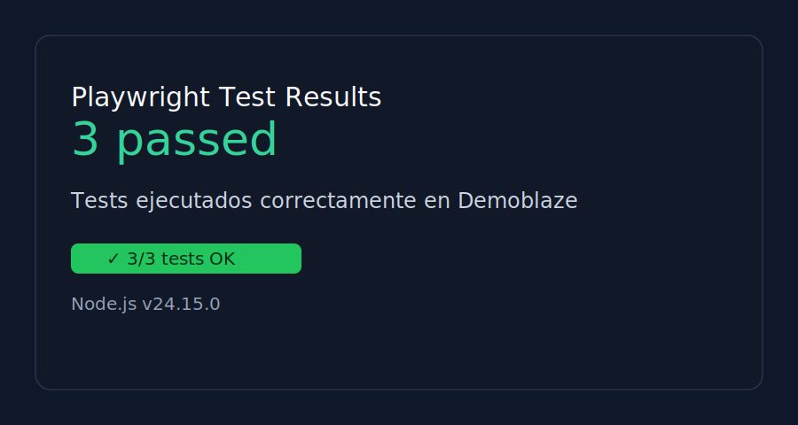

# QA Playwright - Demoblaze

## Información del estudiante
- Nombre: Jaquelin Natalia Lorenzana León
- Carné: 1790-22-13193

## Entorno
- Node.js: v24.15.0

## Descripción
Este proyecto contiene pruebas automatizadas con Playwright para la página de demostración Demoblaze.

## Ejecución
1. Instalar dependencias:
   ```bash
   npm install
   ```
2. Ejecutar pruebas:
   ```bash
   npm test
   ```

## Resultado de pruebas
Se ejecutó la suite y el resultado fue:
- 3 tests pasando
- Última ejecución: 3 passed (4.7s)


