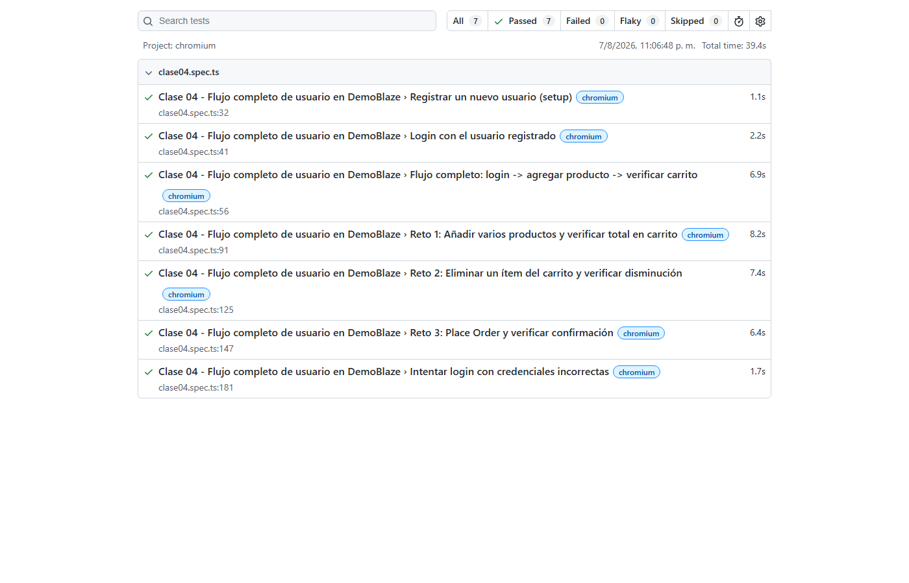
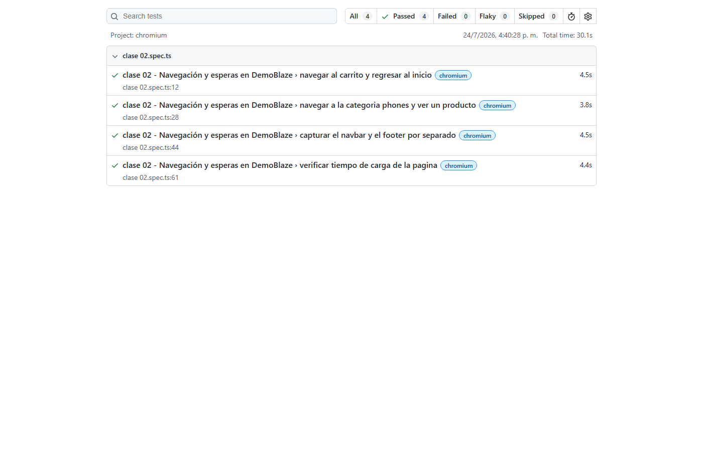
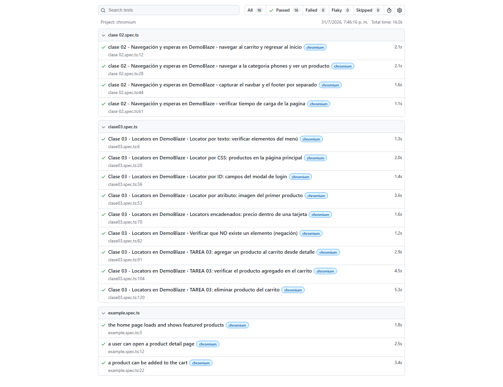

# QA Playwright - Demoblaze

## Estudiante
- Nombre: Jaquelin Natalia Lorenzana León
- Carné: 1790-22-13193

## Entorno
- Node.js: v24.15.0

## Descripción
Este proyecto contiene pruebas automatizadas con Playwright para la página de demostración Demoblaze.

## Ejecución
Esta sección explica cómo ejecutar el proyecto y verificar los tests.

1. Instalar dependencias:
   ```bash
   npm install
   ```
2. Ejecutar la suite de Playwright:
   ```bash
   npm test
   ```
3. Ejecutar solo los tests de Clase 03 (incluye los 6 tests de clase y los 3 tests de la Tarea 03):
   ```bash
   npx playwright test tests/clase03.spec.ts
   ```
4. Ver el reporte interactivo de Playwright:
   ```bash
   npx playwright show-report
   ```

> Nota: el `README.md` sirve como el documento de ejecución para la entrega de la tarea.

## Resultado de pruebas
Se ejecutó la suite y el resultado fue:
- ✅ 3 tests pasando
- Última ejecución: 3 passed (4.6s)
- Fecha: 7/17/2026, 8:53:14 PM
- Total time: 4.6s

### Detalle de tests
1. ✅ **the home page loads and shows featured products** (2.0s) - [example.spec.ts:3](tests/example.spec.ts#L3)
2. ✅ **a user can open a product detail page** (3.0s) - [example.spec.ts:12](tests/example.spec.ts#L12)
3. ✅ **a product can be added to the cart** (3.9s) - [example.spec.ts:22](tests/example.spec.ts#L22)

### Ver el reporte completo
Para abrir el reporte interactivo de Playwright con la interfaz visual de los resultados:
```bash
npx playwright show-report
```

Se abrirá una ventana en http://localhost:9323/ mostrando:
- **All (3)**: Los 3 tests ejecutados
- **Passed (3)**: Los 3 tests pasaron correctamente (con checkmark verde ✅)
- **Failed (0)**: Sin fallos
- **Project**: chromium
- **Duración**: 4.6s total

### Captura del reporte real


**Reporte actual (clase 02):**


**Reporte actual (clase 03):**


## Reporte de tests — Clase 04

El resultado de la ejecución de los tests de la Clase 04 y los retos se muestra en el reporte interactivo dentro de `playwright-report/`.

- Imagen representativa del reporte (captura):


- Abrir reporte interactivo:

```bash
npx playwright show-report
```

## Reflexión: auto-wait vs sleep
En Playwright es mejor usar el auto-wait incorporado y los selectores inteligentes en lugar de `page.waitForTimeout()` o `sleep()`.
- `expect(...)`, `page.waitForSelector()` y `page.goto(..., { waitUntil: ... })` esperan dinámicamente a que la página o el elemento esté listo.
- `sleep()` bloquea el test y hace la suite más lenta, además de poder ocultar problemas reales de sincronización.
- El auto-wait hace las pruebas más estables y reduce el riesgo de falsos negativos.

## Tarea 05 — Instrucciones de entrega

Archivos entregables en esta tarea:
- [tests/clase05.spec.ts](tests/clase05.spec.ts) — suite con 10 tests base + 3 tests reto (toHaveValue, toBeFocused, toHaveCSS).
- [casos-de-prueba/tabla-decision-checkout.md](casos-de-prueba/tabla-decision-checkout.md) — tabla de decisión con condiciones y reglas.

Ejecutar solo los tests de la tarea:
```bash
npx playwright test tests/clase05.spec.ts
```

Generar y abrir el reporte HTML (tras ejecutar los tests):
```bash
npx playwright show-report
```

Sugerencia de commit y push (crear branch `tarea05`):
```bash
git checkout -b tarea05
git add tests/clase05.spec.ts casos-de-prueba/tabla-decision-checkout.md README.md
git commit -m "Tarea05: añadir 3 retos y tabla de decision"
git push origin tarea05
```

Entrega en Canvas:
- Subir enlace de tu repositorio (branch `tarea05` o `main`) con este README como guía de ejecución.
- Indicar en la entrega que `tests/clase05.spec.ts` contiene los 3 retos solicitados.

Fecha de entrega original: viernes 14 de agosto, 23:59.

