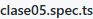
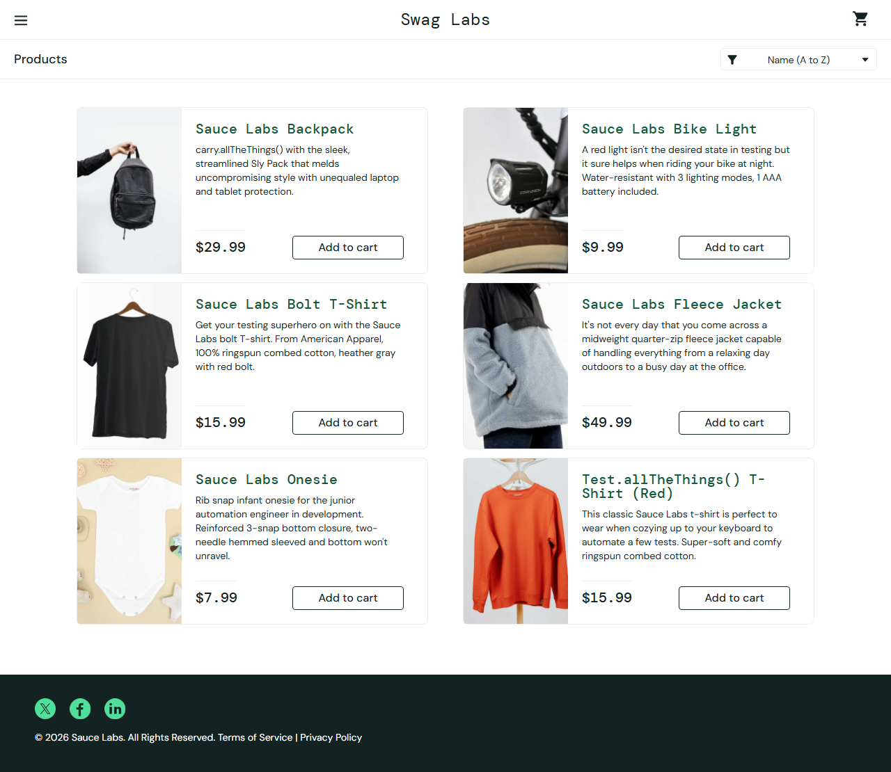
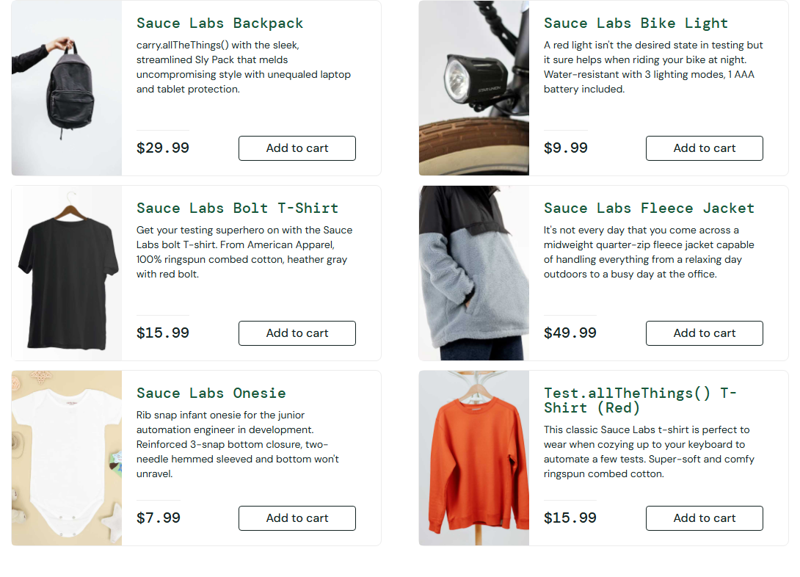
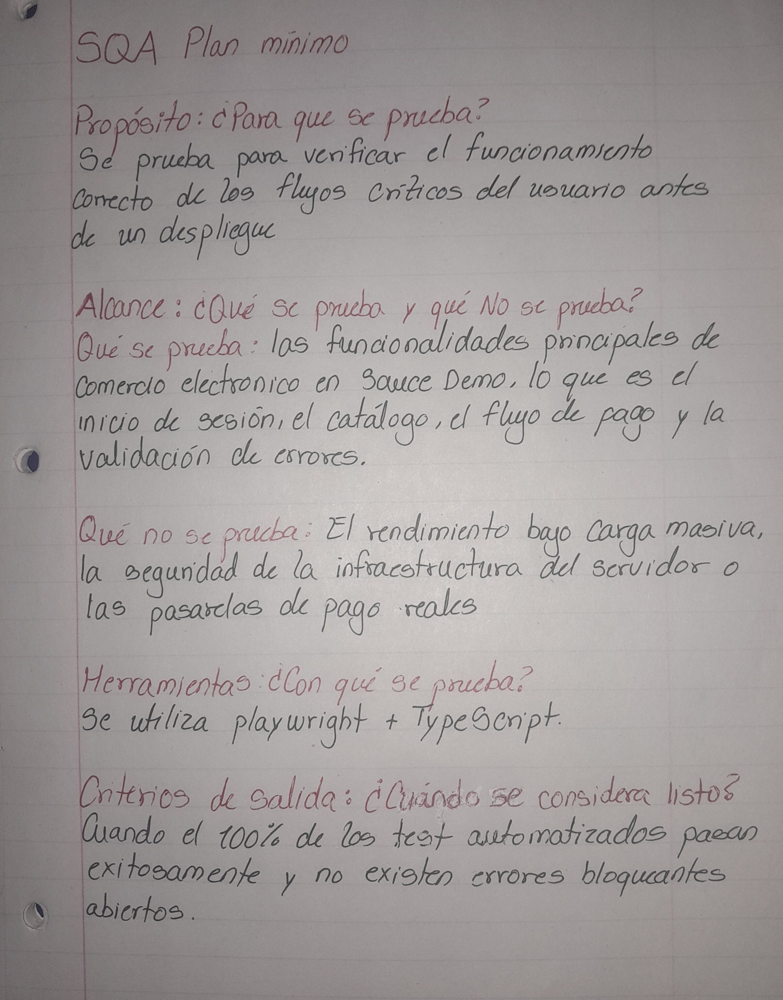

# QA Playwright - Demoblaze

## Estudiante
- Nombre: Jaquelin Natalia Lorenzana León
- Carné: 1790-22-13193

## Entorno
- Node.js: v24.15.0

## Descripción
Este proyecto contiene pruebas automatizadas con Playwright para la página de demostración Demoblaze.

## Ejecución
Esta sección explica cómo ejecutar el proyecto y verificar los tests.

1. Instalar dependencias:
   ```bash
   npm install
   ```
2. Ejecutar la suite de Playwright:
   ```bash
   npm test
   ```
3. Ejecutar solo los tests de Clase 03 (incluye los 6 tests de clase y los 3 tests de la Tarea 03):
   ```bash
   npx playwright test tests/clase03.spec.ts
   ```
4. Ver el reporte interactivo de Playwright:
   ```bash
   npx playwright show-report
   ```

> Nota: el `README.md` sirve como el documento de ejecución para la entrega de la tarea.

## Resultado de pruebas
Se ejecutó la suite y el resultado fue:
- ✅ 3 tests pasando
- Última ejecución: 3 passed (4.6s)
- Fecha: 7/17/2026, 8:53:14 PM
- Total time: 4.6s

### Detalle de tests
1. ✅ **the home page loads and shows featured products** (2.0s) - [example.spec.ts:3](tests/example.spec.ts#L3)
2. ✅ **a user can open a product detail page** (3.0s) - [example.spec.ts:12](tests/example.spec.ts#L12)
3. ✅ **a product can be added to the cart** (3.9s) - [example.spec.ts:22](tests/example.spec.ts#L22)

### Ver el reporte completo
Para abrir el reporte interactivo de Playwright con la interfaz visual de los resultados:
```bash
npx playwright show-report
```

Se abrirá una ventana en http://localhost:9323/ mostrando:
- **All (3)**: Los 3 tests ejecutados
- **Passed (3)**: Los 3 tests pasaron correctamente (con checkmark verde ✅)
- **Failed (0)**: Sin fallos
- **Project**: chromium
- **Duración**: 4.6s total

### Captura del reporte real


**Reporte actual (clase 02):**


**Reporte actual (clase 03):**


## Reporte de tests — Clase 04

El resultado de la ejecución de los tests de la Clase 04 y los retos se muestra en el reporte interactivo dentro de `playwright-report/`.

- Imagen representativa del reporte (captura):


- Abrir reporte interactivo:

```bash
npx playwright show-report
```

## Reflexión: auto-wait vs sleep
En Playwright es mejor usar el auto-wait incorporado y los selectores inteligentes en lugar de `page.waitForTimeout()` o `sleep()`.
- `expect(...)`, `page.waitForSelector()` y `page.goto(..., { waitUntil: ... })` esperan dinámicamente a que la página o el elemento esté listo.
- `sleep()` bloquea el test y hace la suite más lenta, además de poder ocultar problemas reales de sincronización.
- El auto-wait hace las pruebas más estables y reduce el riesgo de falsos negativos.

## Tarea 05 — Instrucciones de entrega

Archivos entregables en esta tarea:
- [tests/clase05.spec.ts](tests/clase05.spec.ts) — suite con 10 tests base + 3 tests reto (toHaveValue, toBeFocused, toHaveCSS).
- [casos-de-prueba/tabla-decision-checkout.md](casos-de-prueba/tabla-decision-checkout.md) — tabla de decisión con condiciones y reglas.

Ejecutar solo los tests de la tarea:
```bash
npx playwright test tests/clase05.spec.ts
```

Generar y abrir el reporte HTML (tras ejecutar los tests):
```bash
npx playwright show-report
```

Sugerencia de commit y push (crear branch `tarea05`):
```bash
git checkout -b tarea05
git add tests/clase05.spec.ts casos-de-prueba/tabla-decision-checkout.md README.md
git commit -m "Tarea05: añadir 3 retos y tabla de decision"
git push origin tarea05
```
**Reporte actual (clase 05):**


---

## Tarea 06 — Extender POM a Nuevas Áreas

### Descripción
En esta clase se extendió el Page Object Model (POM) a nuevas áreas de la aplicación, creando tres nuevos Page Objects y ocho tests (5 base + 3 reto).

### Page Objects Creados
- ✅ `pages/CheckoutPage.ts` - Gestiona el flujo de checkout (formulario + finish)
- ✅ `pages/MenuPage.ts` - Gestiona el menú hamburguesa y logout
- ✅ `pages/InventoryPage.ts` - Extendido con método `removeProductByName()`
- ✅ `pages/CartPage.ts` - Gestiona la página del carrito
- ✅ `pages/LoginPage.ts` - Page Object de login (reparado)

### Tests Clase 06 (8 Tests - Todos en Verde ✅)

**5 Tests Base:**
1. ✅ Base 1: Verificar que el inventario se carga correctamente
2. ✅ Base 2: Agregar producto al carrito
3. ✅ Base 3: Ir al carrito y verificar producto
4. ✅ Base 4: Agregar múltiples productos al carrito
5. ✅ Base 5: Ordenar productos por precio (bajo a alto)

**3 Tests Reto:**
6. ✅ Reto 1: Completar compra de principio a fin con CheckoutPage
7. ✅ Reto 2: Probar flujo de logout con MenuPage
8. ✅ Reto 3: Quitar producto y verificar que badge desaparece

### Archivos Entregables Clase 06
- [pages/CheckoutPage.ts](pages/CheckoutPage.ts) — Page Object para checkout
- [pages/MenuPage.ts](pages/MenuPage.ts) — Page Object para menú y logout
- [pages/InventoryPage.ts](pages/InventoryPage.ts) — Extendido con removeProductByName()
- [pages/CartPage.ts](pages/CartPage.ts) — Page Object para carrito
- [tests/clase06.spec.ts](tests/clase06.spec.ts) — Suite con 8 tests

### Ejecutar tests de Clase 06
```bash
npx playwright test tests/clase06.spec.ts
```

### Resultado de Pruebas Clase 06
- ✅ 8 tests pasando
- Última ejecución: 8 passed (4.0s)
- Fecha: 28/8/2026
- Total time: 4.0s


---

## Tarea 07 — Evidencias avanzadas

### Descripción
Se implementaron 3 retos con técnicas avanzadas de Playwright para documentar el flujo de pruebas con evidencia visual y datos de ejecución:

- ✅ `test.step()` para dividir el caso en pasos claros
- ✅ `testInfo.attach()` para adjuntar contenido textual como evidencia
- ✅ `toHaveScreenshot()` para comparar visualmente una pantalla con un baseline

### Archivos entregables Clase 07
- [tests/clase07.spec.ts](tests/clase07.spec.ts) — suite con los 3 retos
- [tests/tarea07.spec.ts](tests/tarea07.spec.ts) — versión adicional del entregable
- [reportes/DR-001.md](reportes/DR-001.md) — defecto simulado documentado
- [evidencias/clase07](evidencias/clase07) — capturas automáticas de evidencia

### Ejecutar tests de Clase 07
```bash
npx playwright test tests/clase07.spec.ts
```

### Resultado de Pruebas Clase 07
- ✅ 3 tests pasando
- Última ejecución: 3 passed (2.7s)
- Fecha: 11/9/2026
- Total time: 2.7s



---

## Evidencias visuales finales

### Captura 1: inventario cargado tras login


### Captura 2: datos de evidencia del login adjuntados


### Captura 3: screenshot de comparación del inventario


---

## Tarea 08 - Hooks y suites avanzados

Se implementaron los tres retos solicitados para practicar hooks y configuración avanzada de suites en Playwright:

- `test.describe.configure({ mode: 'serial' })` con una página compartida creada en `beforeAll`.
- `test.slow()` para el usuario con lentitud artificial.
- `test.skip()` dinámico según la variable de entorno `SKIP_DYNAMIC_TEST`.

### Archivos entregables

- [helpers/auth.ts](helpers/auth.ts) - helper reutilizable de autenticación.
- [tests/clase08.spec.ts](tests/clase08.spec.ts) - suite con los 3 tests reto.
- [documentos/sqa-plan-saucedemo.md](documentos/sqa-plan-saucedemo.md) - SQA Plan mínimo.
- [assets/test-report-clase08.md](assets/test-report-clase08.md) - evidencia de las ejecuciones.

### Ejecución

```bash
npx playwright test tests/clase08.spec.ts
```

Resultado: **3 tests pasando**.

Para verificar el skip dinámico en PowerShell:

```powershell
$env:SKIP_DYNAMIC_TEST = 'true'; npx playwright test tests/clase08.spec.ts
```

Resultado: **2 tests pasando y 1 test omitido**.

### Evidencia manuscrita del SQA Plan




